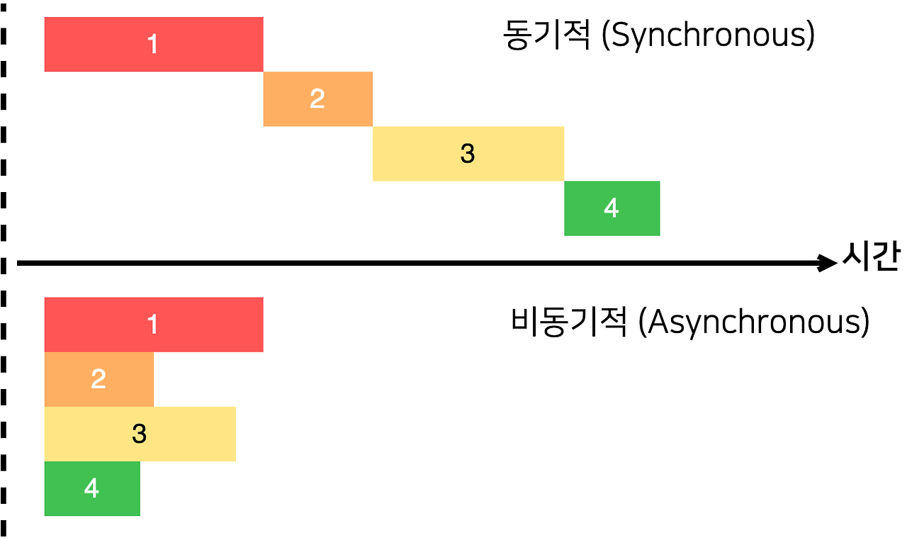

# docker_supabase_study

## DB 모델링
+ member 테이블:
  - 이메일 (Primary Key)
  - 이름
  - 비밀번호

+ 민원분류 테이블:
  - id (serial, Primary Key)
  - 내용 (카테고리, 예: 공공민원, 건강/의료)

+ 민원내용 테이블:
  - 작성자 (Foreign Key, member 테이블의 이메일 참조)
  - 민원분류 (Foreign Key, 민원분류 테이블의 id 참조)
  - 작성날짜 (DATE)
  - 작성시간 (TIMESTAMP)
  - 민원내용 (TEXT) 

<b>** csv 파일로 모델이 실시간 처리예정 : 스키마 생성 필요없음 **</b>
+ chatbot 테이블:
  - 원천 질문 데이터 (TEXT) ** 인덱스 지정
  - 민원 ID (Foreign Key, 민원분류 테이블의 id 참조)
  - 로봇 답변 데이터 (TEXT)
  - category (varchar, 필터링 기준)

 

---
<h3> 동기와 비동기 처리 - 챗봇의 트래픽 처리 방법 ① </h3>

동기처리는 하나의 task가 끝난 후 다음 task를 진행하지만 비동기 처리는 task가 들어오면 즉시 실행되므로 사용자의 실행 경험을 향상시킬 수 있다.

특히 이번 프로젝트의 실시간 챗봇 구현에 있어서 사용자 트래픽이 증가할 경우, 먼저 입장한 A 사용자의 질문을 머신러닝 모델이 처리하는 동안 B 사용자는 대기해야 하는데 대기 시간이 길어질 경우 사용자는 서버가 멈춘 것처럼 느껴질 수 있기에 파이썬의 비동기 처리 방식을 고려했다.

트래픽이 증가할 것을 생각했을 때, 배치 처리 방식으로 일정 시간 대기하며 모아둔 질문을 넘기되 각 taks 마다 모델을 배치하는 방향으로 구현 중이다.
